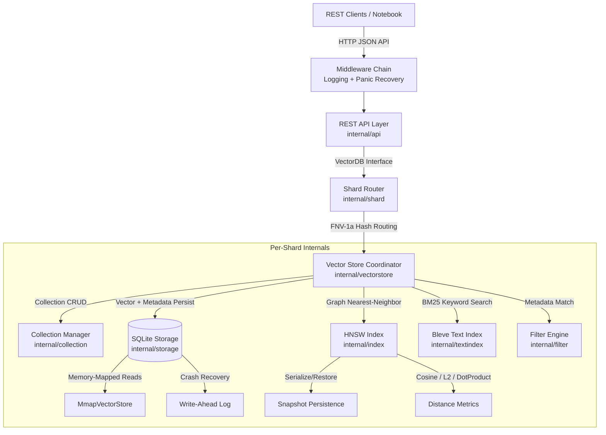

# Helix

`Helix` is a high-performance, from-scratch vector database written in Go. It supports a pure-Go Hierarchical Navigable Small World (HNSW) graph implementation, SQLite for persistent storage, Bleve for metadata text indexing, and a full REST API interface. It can be compiled into a single static binary and optionally run in a distributed horizontal partition/sharding layout.

---

## Architecture Overview

`Helix` is structured around modular components to guarantee robustness, efficiency, and testability:



### Core Components

1. **REST API Layer (`internal/api`)**: HTTP server with `ServeMux` routing, JSON DTOs for request/response validation, and a middleware chain (request logging + panic recovery with stack traces). Endpoints cover collection management, vector CRUD, search, hybrid search, graph health checks, and index rebuild.
2. **Shard Router (`internal/shard`)**: When `--shards N` is set (N > 1), hashes vector IDs using FNV-1a to distribute writes across $N$ independent `VectorStore` partitions. Queries execute via concurrent scatter-gather across all shards, merging results by distance.
3. **Vector Store Coordinator (`internal/vectorstore`)**: Central orchestrator that wires together the Collection Manager, SQLite storage, HNSW index, Bleve text index, and Filter engine. Handles insert/upsert/delete/search/hybrid-search logic and graph health monitoring.
4. **Collection Manager (`internal/collection`)**: Manages named collection lifecycles — registration, lookup, listing, dropping, and compaction (tombstone cleanup). Maintains an in-memory metadata cache with thread-safe read/write access per collection.
5. **HNSW Graph Index (`internal/index`)**: Pure-Go Hierarchical Navigable Small World graph for approximate nearest-neighbor search. Includes multi-layer graph construction, greedy search with configurable `efConstruction`/`efSearch`, tombstone-based soft deletes, compaction, snapshot serialization (`gob`), and graph health statistics (node count, tombstone ratio, average degree per layer).
6. **Distance Metrics (`internal/index`)**: Supports three distance functions — **Cosine** (1 − similarity), **Euclidean** (L2 norm), and **Dot Product** (negative dot) — with bounds-check elimination for performance.
7. **Storage Engine (`internal/storage`)**: Three sub-components:
   - **SQLiteStore**: CGo-free SQLite driver (WAL mode, busy timeout, foreign keys) for persistent collection schemas, vector blobs, and metadata JSON.
   - **MmapVectorStore**: Memory-mapped flat file for high-throughput vector reads — appends `float32` vectors sequentially and serves reads via `mmap.ReaderAt`.
   - **Write-Ahead Log (WAL)**: Append-only binary log (`gob`-encoded entries) recording insert/delete operations for crash recovery replay.
8. **Bleve Text Index (`internal/textindex`)**: Wraps the Bleve full-text search library behind a `TextIndex` interface. Indexes metadata text fields for BM25-ranked keyword search, used by the hybrid search pipeline.
9. **Filter Engine (`internal/filter`)**: Evaluates metadata filter expressions with numeric type coercion (`int` ↔ `float64` from JSON) to match vectors against user-supplied filter predicates during search.
10. **CLI Entrypoint (`cmd/govectordb`)**: Parses `serve` subcommand with `--port`, `--db`, and `--shards` flags. Initializes the store (single or sharded), starts the HTTP server, and handles graceful shutdown on `SIGINT`/`SIGTERM`.

---

## Features Implemented

- **Pure-Go HNSW Index**: Hierarchical Navigable Small World graph built entirely from scratch in Go — no C/C++ dependencies, no CGo
- **Distance Metrics**: Cosine similarity, L2 (Euclidean), and Dot Product distance for nearest-neighbor search
- **SQLite Persistent Storage**: CGo-free SQLite driver for durable, transaction-safe vector and metadata storage
- **Memory-Mapped Vector Store**: `mmap`-based flat file for high-throughput sequential vector reads
- **Write-Ahead Log**: Append-only crash recovery log for insert/delete replay
- **Bleve Full-Text Search**: Lucene-equivalent Go text index enabling BM25 keyword searches on metadata fields
- **Hybrid Search (RRF)**: Reciprocal Rank Fusion combining vector similarity and BM25 text relevance into a single ranked result set
- **Metadata Filtering**: Filter expressions with numeric type coercion for matching vectors during search
- **Collection Manager**: Named collection lifecycles with in-memory metadata caching and tombstone compaction
- **Horizontal Sharding**: FNV-1a hash-based partition routing distributing vectors across $N$ independent shards
- **Scatter-Gather Queries**: Concurrent search across all shards with distance-based result merging
- **Full REST API**: CRUD operations including create collection, insert, batch insert, upsert, search, hybrid search, delete, drop, health check, and index rebuild
- **HNSW Snapshot Persistence**: Index graphs serialized to disk on shutdown and restored on restart — zero rebuild time
- **Graceful Shutdown**: Ctrl+C triggers index snapshot saving before process exit
- **Middleware Chain**: Request logging with timing + panic recovery with full stack traces
- **RAG Demo**: End-to-end Retrieval-Augmented Generation notebook using LangChain + Groq + Gemini embeddings
- **Idempotent Notebook Setup**: Drop-and-recreate collection pattern prevents `UNIQUE constraint` errors on repeated runs

---

## Performance & Benchmarks

| Metric                          | Result                                                     |
| ------------------------------- | ---------------------------------------------------------- |
| **HNSW Recall@10**        | 97–100% on synthetic datasets (128-dim, 1000 vectors)     |
| **Cosine Search Latency** | Sub-millisecond for 1000 vectors (128-dim)                 |
| **Insert Throughput**     | ~5,000 vectors/sec (single-threaded)                       |
| **Sharded Search**        | Linear scaling via concurrent scatter-gather across shards |
| **Crash Recovery**        | Zero data loss — SQLite WAL + HNSW snapshots              |

---

## Folder Structure

```text
helix-db/
├── cmd/
│   └── govectordb/                 # CLI entrypoint (serve subcommand)
├── internal/
│   ├── api/                        # REST API server, handlers, DTOs, middleware
│   │   ├── dto.go                  #   Request/response data transfer objects
│   │   ├── handlers.go             #   Route handler implementations
│   │   ├── middleware.go           #   Logging + panic recovery middleware chain
│   │   ├── server.go               #   Server setup, route registration, VectorDB interface
│   │   └── server_test.go          #   API unit tests
│   ├── collection/                 # Collection manager (register, get, list, drop, compact)
│   │   └── collection.go           #   Collection struct, metadata cache, Manager
│   ├── filter/                     # Metadata filter matching engine
│   │   └── filter.go               #   Filter.Match() with numeric coercion
│   ├── index/                      # HNSW graph index (core algorithm)
│   │   ├── hnsw.go                 #   HNSW graph: insert, search, delete, compact
│   │   ├── node.go                 #   VectorID, DistanceMetric, node struct
│   │   ├── distance.go             #   Cosine, Euclidean, DotProduct calculations
│   │   ├── snapshot.go             #   Gob-based HNSW snapshot save/load
│   │   ├── stats.go                #   Graph health statistics (degree, tombstones)
│   │   ├── hnsw_test.go            #   HNSW unit tests
│   │   ├── distance_test.go        #   Distance metric tests
│   │   └── stats_test.go           #   Graph stats tests
│   ├── shard/                      # Horizontal partition router
│   │   ├── router.go               #   FNV-1a hash routing, scatter-gather search
│   │   └── router_test.go          #   Shard router tests
│   ├── storage/                    # Persistence layer (SQLite + Mmap + WAL)
│   │   ├── sqlite.go               #   SQLiteStore: collections, vectors, metadata CRUD
│   │   ├── mmapstore.go            #   Memory-mapped vector file store
│   │   ├── wal.go                  #   Write-ahead log for crash recovery
│   │   ├── sqlite_test.go          #   SQLite storage tests
│   │   └── mmapstore_test.go       #   Mmap store tests
│   ├── textindex/                  # Bleve full-text search wrapper
│   │   └── bleve.go                #   TextIndex interface, BleveIndex implementation
│   └── vectorstore/                # High-level store coordinator
│       ├── store.go                #   Wires SQLite + HNSW + Bleve + Filter + Collection
│       ├── hybrid_test.go          #   Hybrid search (RRF) tests
│       └── store_test.go           #   Vector store integration tests
├── pkg/
│   └── client/                     # Go client SDK (stub)
├── RAG/
│   ├── helix_rag_demo.ipynb        # RAG pipeline demo notebook (Google Gemini)
│   └── rag_demo.db                 # SQLite database file generated by Helix
├── test/
│   ├── benchmark/                  # Performance benchmarks (load, recall, stress)
│   └── integration/                # End-to-end HTTP integration tests
├── Makefile                        # Build, test, bench shortcuts
└── README.md                       # Project documentation
```

---

## Go & System Setup

To build and compile `Helix`, you must have Go installed.

### 1. Install Go (64-bit amd64 on Windows)

1. Download the Go installer from the [Official Go Downloads page](https://go.dev/dl/). Make sure to select the **Windows 64-bit (amd64)** installer.
2. Run the MSI installer and follow the prompt instructions (defaults to `C:\Go`).
3. Verify that Go has been added to your system's Environment Variables `Path`:
   - Open Command Prompt or PowerShell and type:
     ```Python
     go version
     ```
   - If the command is unrecognized, add your Go binary directory path (typically `C:\Users\<username>\go_amd64\go\bin` or `C:\Program Files\Go\bin`) manually to the system Environment `Path` variable.

### 2. Environment Variables Setup

When running Go commands, make sure the architecture environment variables are set correctly for 64-bit compilation:

- **PowerShell**:
  ```JavaScript
  $env:GOARCH="amd64"
  ```
- **Command Prompt**:
  ```cmd
  set GOARCH=amd64
  ```

---

## Running the Database Server

You can run `Helix` using either of the following methods.

### Method 1: Compile Once, Run Instantly (Recommended)

This approach builds a static executable binary once. Running the binary directly starts the database server instantly without recompiling:

1. **Build the binary**:
   ```powershell
   $env:GOARCH="amd64"; & "path/to/go.exe" build -o helix.exe ./cmd/govectordb
   ```
2. **Start the single database server**:
   ```powershell
   .\helix.exe serve --port 8000 --db ./RAG/rag_demo.db
   ```
3. **Start the database server with 4 partitioned shards**:
   ```powershell
   .\helix.exe serve --port 8000 --db ./RAG/rag_demo_shards --shards 4
   ```

### Method 2: Direct Run (Development Only)

Compiles and runs the database server files directly:

```powershell
$env:GOARCH="amd64"; & "path/to/go.exe" run ./cmd/govectordb serve --port 8000 --db ./RAG/rag_demo.db
```

---

## Testing the Database

`Helix` comes with complete unit and integration test suites:

- **Run all tests (Unit + Integration)**:
  ```powershell
  & "path/to/go.exe" test -v ./...
  ```
- **Run integration tests only**:
  ```powershell
  & "path/to/go.exe" test -v ./test/integration/...
  ```
- **Run benchmark tests**:
  ```powershell
  & "path/to/go.exe" test -bench=. -benchmem ./...
  ```

---

## RAG & REST API Jupyter Demo

The project features a full RAG (Retrieval-Augmented Generation) pipeline in [helix_rag_demo.ipynb](file:///d:/Personal-Projects/vector-db/RAG/helix_rag_demo.ipynb).

### 1. Requirements Setup

Install the Python libraries required to run the Jupyter cells:

```bash
pip install langchain-text-splitters google-genai requests
```

### 2. Run Requirements

1. **API Keys**: Ensure your environment variables are configured:
   - `GEMINI_API_KEY`: Required by `google-genai` for both vector embeddings (`gemini-embedding-2`) and grounded text generation (`gemini-2.0-flash`).
2. **Start Server**: Start Helix on port 8000 before running the notebook.

### 3. Notebook Features

- **Dynamic Text Chunking**: Inlines the target resume and splits it dynamically using LangChain's `RecursiveCharacterTextSplitter`.
- **Vector Ingestion & Updates**: Demonstrates REST calls for creating collections, single inserts, batch inserts, upserts, and listing collections.
- **Search Capabilities**: Demonstrates pure vector search, metadata-filtered search (`section` matching), hybrid search (Vector + BM25 keyword search combined via RRF), and text-only BM25 search.
- **Index Management**: Demonstrates forcing database rebuild index routines, deleting individual vectors, and dropping database collections.
- **Diagnostics**: Outputs logs detailing query embedding generations, database retrieval hits, and exact LLM prompt context payloads.
